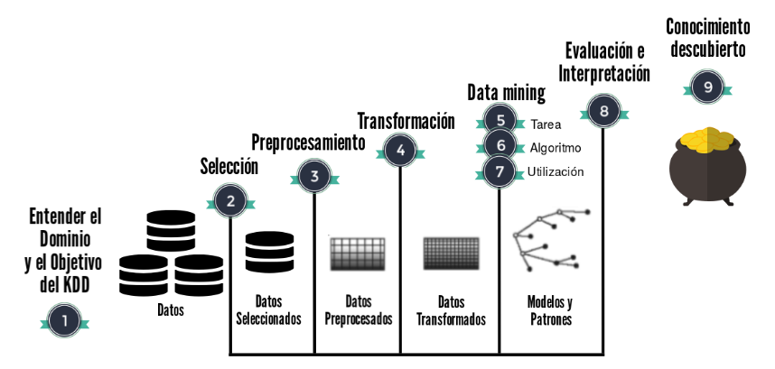

```{r setup, include=FALSE}
knitr::opts_chunk$set(echo = TRUE)
```

### Referencias

Este curso está basado en:
* [Ciencia de Datos para Gente Sociable](https://bitsandbricks.github.io/ciencia_de_datos_gente_sociable/) de Antonio Vazquez Brust 
* [Introducción a Data Science](https://github.com/DiegoKoz/intro_ds) de Diego Kozlowski y Natsumi Shokida
* Clases de Santiago Banchero y Juan Manuel Fernández en la Maestría de Data Mining de la UBA. https://dmuba.github.io/

## Introducción breve a Data Science

- Mayor volumen de datos
- Disponibilidad de accesos (APIs)
- Datos abiertos
- Múltiples y diversas aplicaciones de la Ciencia de Datos


El término está adquiriendo cada vez mayor popularidad:


También ciencia de datos se intercambia con otros términos: data mining/kdd/data analysis/BI/etc.

Se nutre y está relacionado con diferentes campos/temáticas:

- Estadística
- Machine Learning / Aprendizaje Automático
- Data Warehouse
- BDD
- Algoritmos
- Reconocimiento de patrones
- Visualizaciones
- HPC (High Performance Computing)

Relacionado con Knowledge Discovery in Databases, concepto para describir el proceso de cómo extraer conocimiento basado y potenciado por los datos.

Proceso interactivo e iterativo:



Algunas aplicaciones del data science:

- Reconocimiento y análisis de imagenes (médicas por ej.)
- Detección de fraude
- Sistemas de recomendación
- Reconocimiento de voz
- Web Mining


## Intro a R

- Lenguaje de programación para análisis de datos
- Software libre y gratuito
- Comunidad dinámica y abierta. Específicamente en Buenos Aires: [R-Ladies Buenos Aires](https://www.meetup.com/es-ES/rladies-buenos-aires/) y [RenBaires](https://www.meetup.com/es-ES/renbaires/)
- Principalmente motorizado por los aportes de sus usuarios (vía paquetes y [stackoverflow](https://stackoverflow.com/))


Se puede descargar [aquí](https://cran.rstudio.com/)

El entorno de desarrollo integrado ("IDE", por sus siglas en inglés) más popular es RStudio. Se puede descargar [aquí](https://www.rstudio.com/products/rstudio/download/)

Así se ve el entorno:

![img/rstudio.png]

## Primeras operaciones en R

R es un lenguaje de programación orientado a objetos, los cuales son fundamentales para el mismo. Todo lo que se guarda en R es un objeto con un nombre específico que no permite espacios. Hay diferentes tipos de objetos: números, listas, funciones, gráficos, tablas y muchos más que ya iremos viendo. Los objetos se almacenan en el ambiente (environment).

El operador __```<-```__ se utiliza para definir objeto. Es un operador unidireccional, por lo cual  __A la izquierda__ del __```<-```__ debe ubicarse el nombre que tomará el elemento a crear. __Del lado derecho__ debe ir la definición del mismo. Al definir un objeto, su contenido queda guardado en el ambiente para poder ser usado de forma posterior.

Para ejecutar cada línea de código, debemos ejecutarla presionando ```Ctrl``` + ```Enter```. Seleccionando varías líneas de código y utilizando el mismo comando (```Ctrl``` + ```Enter```) se irán ejecutando una por una.

```{r}
ejemplo1 <- 1
ejemplo1
```
Una vez que tenemos el objeto ```ejemplo1``` creado, podemos hacer operaciones sobre el mismo ya que está guardado.
```{r}
ejemplo1*3
```
Con esta última operación, ```ejemplo 1``` no cambia su valor a 3, solamente cambia para el output de esa línea de código. Para guardar el cambio, hay que asignar ese output a un objeto (sea ```ejemplo1``` o algún otro)

### Diferentes tipos de operadores

#### Operadores lógicos
- Mayor a: $>$ o menor a: $<$
- Mayor o igual a: $>=$ o menor o igual a: $<=$ 
- Igual a: $==$
- Distinto a: $!=$ (distinto a-)

```{r}
# Redefinimos los valores A y B
A <- 10
B <- 20
# Realizamos comparaciones lógicas
A >  B
A >= B
A <  B
A <= B
A == B
A != B
C <- A != B
C
```
#### Operadores matemáticos
#### Operadores aritméticos:

```{r}
#suma
ejsuma <- 3+3
ejsuma
#cociente
ejcociente <- 7/2.5
ejcociente
#potencia
ejpotencia <- 5^2.5
ejpotencia
```
### Tipos de objetos:    
Hay diferentes tipos de objetos en R, vamos a ver algunos de ellos:

#### Valores
Los valores (y vectores que los contienen) pueden ser de distintas _clases_, las principales son las siguientes:

- character: ```"bew"```, ```frase estándar```
- numeric (real or decimal): ```3.5```
- integer: ```3```
- logical: booleanos (```TRUE```, ````FALSE```)

Con la función ```class()``` podemos consultar la clase del objeto.
__Numeric__     

```{r}
numero <-  1
class(numero)
```


__Character__
```{r}
palabra <-  "ejemplo"
class(palabra)
```


__Factor__
```{r}
A <- factor("Nivel 1 de un factor")
class(A)
levels(A)
```

La diferencia entre un _character_ y un _factor_ es que el último tiene solo algunos valores permitidos (funcionan como categorías predefinidas, los podemos consultar con la funcion ```levels()```), con un orden interno que se mantiene a la hora de graficar por ejemplo.  


#### Vectores

Para generar un vector utilizamos el comando ```c()```.

```{r}
ejvector <- c(1, 3, 4)
ejvector
```

Podemos realizar diferentes operaciones sobre ese vector

```{r}
ejvector * 2
```

Podemos crear un vector que contenga diferentes ```strings```
```{r}
utiles <- c("Lapicera", "Lápiz", "Goma de borrar")
utiles
```

Si intentamos crear vector que contenga diferentes tipos de valores, R va a forzar a que sean de un mismo tipo
```{r}
a <- c(1, "asd", 3)
a
class(a[1])
```

Para acceder a algún elemento del vector, podemos buscarlo por su número de orden que funciona como su número de índice, entre ```[ ]```. En R, los índices comienzan con 1 (a diferencia de la mayoría de los lenguajes de programación, donde empiezan con el 0)

```{r}
utiles[3]
```

Este valor lo podemos almacenar en un objeto nuevo, y se va a almacenar solamente este valor

```{r}
ultimoutil <- utiles[3]
ultimoutil
```

También podemos usar la posición en ese vector para reemplazar el valor

```{r}
utiles[3] <- "sacapuntas" 
utiles
```
### Data Frames

Un Data Frame es una tabla de datos, donde las columnas representan variables y las filas observaciones/registros

Seguramente resulte central en nuestro proceso de trabajo, ya que muchos de los datos que vamos a lidiar son tabulares y permiten diferentes operaciones, modelos y funciones muy útiles y diversas.

Al igual que un vector se puede entender como una concatenación de valores, se puede entender a un dataframe como una combinación de N vectores del mismo tamaño. Por ejemplo, tomamos como ejemplo los [Garajes de CABA](https://data.buenosaires.gob.ar/dataset/garajes-comerciales)

```{r}
SMP  <- c("047-106-028","033-044-012", "033-056C-023A", "033-012-031", "033-023-032")
CALLENOMBRE  <-  c("ARENAL, CONCEPCION","BONPLAND","CORDOBA",
                   "RAMIREZ DE VELAZCO, JUAN","BONPLAND")
CALLEALTURA  <-  c(4519, 1147, 5640, 1418, 966)
garajes <- data.frame(SMP, CALLENOMBRE, CALLEALTURA)
garajes
```

Al igual que en un __vector__ se accede a los elementos con ```[ ]```, en un __dataframe__ se accede a sus elementos de la forma __```[fila, columna]```__.

Otra opción es especificar la columna, mediante el operador ```$```, y luego seleccionar el registro deseado.

```{r}
garajes$CALLEALTURA
garajes[4,2]
garajes$CALLEALTURA[4]
```
Si ya estamos llamando a una variable con el operador ```$```, debemos sólo acceder a la posición del registro que estamos buscando.

Acceder a los __dataframes__ mediante  ```[ ]``` puede utilizarse para realizar filtros sobre la base, poniendo una condición para las filas. Por ejemplo, puedo utilizar los  ```[ ]``` para conservar del __dataframe__ ```garajes ```  unicamente los registros de la calle Bonpland:

```{r error=TRUE}
garajes[garajes$CALLENOMBRE=="BONPLAND",]
```
Como vimos anteriormente, puedo usar este filtro y guardar la información en un nuevo objeto.

### Listas

Concatenan objetos de cualquier índole, sean dataframes, vectores, valores, otras listas y más.

```{r}
lista <- list(1, utiles, DF = garajes, CALLEALTURA, c(1,2,3))
lista
```

Para acceder un elemento de una lista, podemos utilizar los corchetes. podemos utilizar el operador __```$```__, que se puede usar a su vez de forma iterativa. 

```{r}
lista
lista$DF$CALLENOMBRE
lista[5]
```

### Uso de ciertos caracteres en R

- R distingue entre minúsculas y mayúsculas
- El numeral ```#``` se utiliza para hacer comentarios, todo lo que vaya después del mismo no es "leído" por R. Se debe utilizar por línea que se quiera comentar.
- Como vimos anteriormente, los corchetes se utilizan para acceder a los elementos.
- También vimos que ```$``` es una forma de acceso, en los dataframes para acceder a las columnas pero tiene otros casos de uso también.
- Los paréntesis ```()``` engloban los parámetros de la función a la que estamos llamando
- Las comas ```,``` separan parámetros de una función.

### Instalar librerías
Hasta ahora, hemos trabajado con lo que se llama ```R Base```, es decir las funciones que R contiene como base, pero gran parte de su riqueza está en las librerías que crean sus usuarios.

Se instalan con el comando ```install.packages()```, cuyo parámetro es el nombre de la librería entre paréntesis. También se puede pasar un vector de nombres de librerías para instalar varias a la vez.

Cada vez que se inicia una sesión en R, se debe llamar a las librerías que deseamos usar con el parámetro ```library()```

Vamos a instalar algunas librerías que utilizaremos:
```{r}
#install.packages(c("tidyverse", "data.table", "openxlsx", "readxl", "xlsx", "ggthemes"),repos = "http://cran.us.r-project.org")
```

### Lectura/escrituras de archivos
Vamos a empezar viendo cómo levantar archivos en los formatos de datos tabulares más clásicos: csv, txt y excel.

Hay muchas funciones para levantar csv o txt, sobre todo cambian: el delimitador, el encabezado y el separador decimal.

Vamos a utilizar la función ```read.csv``` (pero podría ser ```read.table```, ```fread```, ```read.delim```, en general cambian sus parámetros default, hay algunas más óptimas que otras). Le estamos pasando como parámetro de ubicación una URL (generada por el portal de datos de CABA), pero puede ser la ubicación de un archivo en la pc local (línea de código comentada) 
```{r}
radares <- read.csv("http://cdn.buenosaires.gob.ar/datosabiertos/datasets/flujo-vehicular-por-radares-ausa/flujo-vehicular-por-radares-2019.csv", header=TRUE, sep=',', dec='.')
head(radares)
#radares <- read.csv("C:/Users/rama_/Desktop/Ramiro/Transito radares ausa/flujo-vehicular-por-radares-2019.csv", header=TRUE, sep=',', dec='.')
# si esta en mi directorio de trabajo, directamente:
#radares <- read.csv("flujo-vehicular-por-radares-2019.csv", header=TRUE, sep=',', dec='.')
```
Una vez que tenemos cargado un dataframe, podemos aplicar varias funciones para explorarlo.

Podemos "imprimir" (deriva de la función ```print```) sus primeros o sus últimos registros
```{r}
head(radares)
tail(radares)
```
Podemos ver un resumen de sus variables
```{r}
summary(radares)
```
Los nombres de sus columnas (también se puede usar ```names```, ```colnames``` aplica para matrices también, aunque names aplica para vectores)
```{r}
colnames(radares)
```
Cantidad de filas y cantidad de columnas. ```length``` también es muy utilizado, ya que aplica para otros tipos de objetos.
```{r}
nrow(radares)
ncol(radares)
length(radares)
```
La función ```unique()``` nos devuelve un vector con valores únicos desduplicados.
```{r}
unique(radares$autopista_nombre)
```
La función ```table()``` devuelve una tabla de frecuencias absolutas con la cantidad de registros por categoría para la variable.
```{r}
tabla <- table(radares$autopista_nombre)
tabla
```
Con ```prop.table```
```{r}
prop.table(tabla)
```
Puedo hacer una tabla bi-variada también
```{r}
table(radares$autopista_nombre, radares$seccion_sentido)
```
Obtener la media
```{r}
mean(radares$cantidad, na.rm = TRUE)
```
Sumar una columna numérica
```{r}
sum(radares$cantidad)
```
Subsetear el dataframe filtrandolo!
```{r}
radareslugonesydelle <- subset(radares, (radares$autopista_nombre=='AU 4  Lugones')|(radares$autopista_nombre=='AU Dellepiane'))
head(radareslugonesydelle)
```
Puedo guardar este objeto en mi PC local con ```write.csv()``` con los parámetros: objeto a guardar, nombre (y ubicación, aquí por default se me guardará en mi directorio predeterminado) y la última opción evita que R guarde el índice de las filas
```{r}
write.csv(radareslugonesydelle, "radares-lugones-y-dellepiane.csv", row.names = FALSE)
```
Para remover un objeto del ambiente, usamos
```{r}
rm(radares)
```
Para remover todos los objeto del ambiente, usamos
```{r}
rm(list=ls())
```
### Ambiente de trabajo

- Directorio de trabajo. Se obtiene el actual con la función `getwd()`, es *hacia donde apunta el código*, es decir a donde lee los archivos o donde graba los archivos por default. Para setear otro directorio de trabajo, se debe utiliza la función ```setwd()```
- Ambiente: Muestra los plots, nos permite navegar por nuestros directorios, guarda la información de valores y de datos cargados, muestra las librerías instaladas como cargadas y también tiene un display de ayuda, que se accede antecediendo el símbolo ```?``` antes del nombre de una función y al ejecutar esa línea nos lleva a la documentación oficial de la función. 

Algunas aclaraciones:

1. El directorio queda referido a un lugar específico en nuestra computadora local. Si compartimos el script con otro, si cambiamos de pc, si cambiamos la carpeta de lugar u otras operaciones que afecten a esa ruta, las operaciones que impliquen la misma se rompe.
2. El ambiente muestra resultados de diferentes trabajos, no indica qué script lo generó. Esto se puede evitar utilizado proyectos (archivos .Rproj), que generan un ambiente específico para cada proyecto e implica toda una carpeta de trabajo

Rstudio tiene una herramienta muy útil de trabajo que son los **proyectos**. Estos permiten mantener un ambiente de trabajo delimitado por cada uno de nuestros trabajos.

### Tipos de archivos de R

- __Script__: Es un archivo de texto plano, donde podemos poner el código que utilizamos para preservarlo
- __Rnotebook__: También sirve para guardar el código, pero a diferencia de los scripts, se puede compilar (y exportar en diferentes formatos), e intercalar código con resultados (esto es un rnotebook)
- __Rproject__: Es un archivo que define la metadata del proyecto y nos permite tener ambientes "independientes"
- __RDS y Rdata__: Dos formatos de archivos propios de R para guardar datos. Sirven para cargar data rápidamente. 

### Lecturas recomendadas

* [Tidy Data - Hadley Wickham](https://vita.had.co.nz/papers/tidy-data.pdf) Uno de los principales impulsores de R, en este paper explica lo que se considera "Tidy Data"
* [Data Science Livebook - Pablo Casas](https://livebook.datascienceheroes.com/)
* [Cookbook for R](http://www.cookbook-r.com/) Muchas soluciones a algunos problemas básicos de R
* Cheatsheets! Por ejemplo, [Data Science Cheatsheet](https://github.com/ml874/Data-Science-Cheatsheet) o [R Cheatsheet](https://www.rstudio.com/resources/cheatsheets/)


