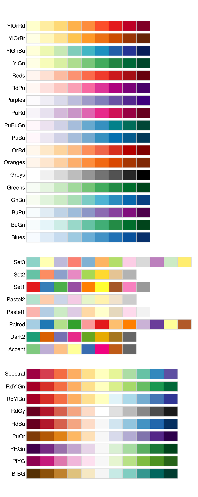

```{r setup, include=FALSE}
knitr::opts_chunk$set(echo = TRUE)
```

## Visualizaciones

### Ggplot2

Vamos a empezar a trabajar con visualizaciones y maneras de graficar en R. Uno de los paquetes de visualizaciones más extendidos en el lenguaje es ```ggplot2```. Efectivamente, adivinaron, es parte de ```tidyverse```. Este lenguaje tiene una sintaxis propia. El mismo funciona con capas, que vamos a ir viendo. Basicamente:

* Con ```ggplot()``` definimos los datos y variables que vamos a utilizar en los ejes del gráfico, como también color, forma, y otros parámetros básicos.

* Con ```+``` incorporamos otras capas al gráfico.

* Hay diferentes capas:
  
  * Tipos de gráficos (```geom_points()```, ```geom_bar()```, ```geom_boxplot()```, entre otros)
  * Títulos (```labs()```)
  * Estilo (```theme()```)
  * Escalas (```scale_y_continuous()``` por ejemplo)
  * División en diferentes gráficos (```facet_wrap()```, ````facet_grid()```)
  * Animación (```transition_revel()```)
  
Hay muchísimas funciones. Las podemos chequear en el [cheatsheet](https://rstudio.com/wp-content/uploads/2016/11/ggplot2-cheatsheet-2.1.pdf).

Para empezar, primero cargamos la librería con ```tidyverse```.

```{r}
#install.packages("tidyverse")
library(tidyverse)
```
Seteamos algunos parámetros generales, cargamos la data que vamos a usar (un set de datos que viene predeterminado con la librería).
```{r}
###Setup
#install.packages("knitr")
#install.packages("kableExtra")
library(knitr)
library(kableExtra)
options(scipen=999)  # apagamos la notación científica
data("midwest", package = "ggplot2")  # cargamos los datos
# midwest <- read.csv("http://goo.gl/G1K41K") # Otra forma de cargar los datos
# Iniciamos Ggplot, sólo va a tener los ejes (columnas del dataframe)
kable(head(midwest))
ggplot(midwest, aes(x=area, y=poptotal))
```

### Scatterplot

Vamos a agrega un simple scatterplot sumando la función ```geom_point()```
```{r}
###Setup
ggplot(midwest, aes(x=area, y=poptotal)) + geom_point()
```
Al igual que ```geom_point()``` hay muchas capas "geom" que podemos ir adicionando para completar o complementar el gráfico. Vamos a agregar una capa suavizada con la función ```geom_smooth(method='lm')```
```{r}

g <- ggplot(midwest, aes(x=area, y=poptotal)) + geom_point() + geom_smooth(method="lm")  # con se=FALSE podemos remover los intervalos de confianza
#los objeto s de ggplot los podemos guardar en un objeto y luego ejecutarlos con la función base de R "plot()""
plot(g)
#buscando en la ayuda podemos ver otros métodos de geom_smooth()
#descomentar y ejecutar!
#?geom_smooth
```
Podemos ajustar los límites de los ejes X e Y. Podemos usar dos métodos: Eliminando los valores por fuera del rango o zoomeando. 

El primer método puede ser realizado con ```xlim()``` y ```ylim()```, pasando un vector delimitando los valores. Al eliminar los valores, la recta dibujada por el modelo lineal modifica su pendiente.
```{r}
g <- ggplot(midwest, aes(x=area, y=poptotal)) + geom_point() + geom_smooth(method="lm")  
# Eliminamos los puntos por fuera del límite
g + xlim(c(0, 0.1)) + ylim(c(0, 1000000))   # deletes points
```
El otro método es zoomear sin eliminar los puntos con ```coord_cartesian()```
```{r}
#Aquí la recta del modelo lineal no cambia porque no eliminamos valores, solamente no los estamos mostrando porque zoomeamos en el rango indicado
g <- ggplot(midwest, aes(x=area, y=poptotal)) + geom_point() + geom_smooth(method="lm") 
g1 <- g + coord_cartesian(xlim=c(0,0.1), ylim=c(0, 1000000))  # zooms in
plot(g1)
```
Podemos sumar títulos y etiquetas para los ejes X e Y. Se puede hacer con ```labs()``` con parámetros ```title```, ```x``` y ```y```, aunque también se puede usar ```ggtitle()```, ```xlab()``` y ```ylab()```.
```{r}
g <- ggplot(midwest, aes(x=area, y=poptotal)) + geom_point() + geom_smooth(method="lm") 

g1 <- g + coord_cartesian(xlim=c(0,0.1), ylim=c(0, 1000000))  

# Sumo títulos o etiquetas
g1 + labs(title="Area Vs Population", subtitle="From midwest dataset", y="Population", x="Area", caption="Midwest Demographics")

# Opción 2

g1 + ggtitle("Area Vs Population", subtitle="From midwest dataset") + xlab("Area") + ylab("Population")

# Puedo hacer el gráfico todo junto
ggplot(midwest, aes(x=area, y=poptotal)) + 
  geom_point() + 
  geom_smooth(method="lm") + 
  coord_cartesian(xlim=c(0,0.1), ylim=c(0, 1000000)) + 
  labs(title="Area Vs Población", subtitle="Dataset Midwest", y="Población", x="Area", caption="Datos demográficos de Midwest")
```
Puedo cambiar el color y el tamaño de la capa "geom" de forma estática, indicando el valor de forma/color que queremos.
```{r}
ggplot(midwest, aes(x=area, y=poptotal)) + 
  geom_point(col="steelblue", size=3) +   # Cambio color y tamaño de los puntos
  geom_smooth(method="lm", col="firebrick") +  # Cambio color de la línea
  coord_cartesian(xlim=c(0, 0.1), ylim=c(0, 1000000)) + 
  labs(title="Area Vs Población", subtitle="Dataset Midwest", y="Población", x="Area", caption="Datos demográficos de Midwest")
```
Respecto a los colores, los podemos indicar de diferentes formas: con valores fijos especificados con el nombre del color (recomendamos chequear [acá](http://www.cookbook-r.com/Graphs/Colors_(ggplot2)/), donde podemos ver funciones de color saturación, luminosidad, entre otros o [acá](http://sape.inf.usi.ch/quick-reference/ggplot2/colour)); con valores fijos determinados en [código HEX](https://www.color-hex.com) o usando paletas predefinidas. Para esto último, recomendamos la librería ```RColorBrewer```, [acá](https://www.rdocumentation.org/packages/RColorBrewer/versions/1.1-2/topics/RColorBrewer) pueden ver la documentación. Igualmente, ggplot2 tiene paletas predefinidas (pero las van a ver en muchos lados, por lo cual está bueno modificarlas!)

Por otra parte, podemos indicar que los atributos visuales (```color```, ```shape```, ```size```, ```stroke```, ```fill```, ```alpha```). Para esto, los tenemos que pasar dentro de la función ```aes()```
```{r}
gg <- ggplot(midwest, aes(x=area, y=poptotal)) + 
  geom_point(aes(col=state), size=3) +  # Acá seteamos el color a la variable "state"
  geom_smooth(method="lm", col="firebrick", size=2) + 
  coord_cartesian(xlim=c(0, 0.1), ylim=c(0, 1000000)) + 
  labs(title="Area Vs Población", subtitle="Dataset Midwest", y="Población", x="Area", caption="Datos demográficos de Midwest")
plot(gg)

#Podemos remover la leyenda sumando theme()
gg + theme(legend.position="None")

#O definir que el gráfico tome una escala en particular
gg + scale_colour_brewer(palette = "Set1")

#Como mencionamos, el paquete RColorBrewer trae muchas paletas copadas
#install.packages(RColorBrewer)
library(RColorBrewer)
kable(head(brewer.pal.info, 10)) 
```
Podemos ver algunas de las paletas de ```RColorBrewer```


También podemos cambiar los valores de la escala. Una forma es con el parámetro ````breaks``` dentro de ```scale_x_continuous()``` (para valores continuos)
```{r}
#Usamos el objeto gg que ya está definido
#A breaks le pasamos una sequencia de valores
gg + scale_x_continuous(breaks=seq(0, 0.1, 0.01))

#A estos breaks le podemos sumar etiquetas. El objeto letters tiene el abecedario guardado
gg + scale_x_continuous(breaks=seq(0, 0.1, 0.01), labels = letters[1:11])

#Se puede revertir la escala con la función scale_x_reverse()
gg + scale_x_reverse()
```
También podemos customizar los textos de los ejes.
```{r}
gg + scale_x_continuous(breaks=seq(0, 0.1, 0.01), labels = sprintf("%1.2f%%", seq(0, 0.1, 0.01))) + 
  scale_y_continuous(breaks=seq(0, 1000000, 200000), labels = function(x){paste0(x/1000, 'K')})
```
También podemos cambiar los fondos del gráfico ("themes"), como ya vimos en R, de un par de maneras diferentes. Podemos encontrar muchos "themes", paletas, geoms (capas de tipos de gráficos) y escalas en la librería ```ggthemes()```
```{r}
# Usando theme_set(), lo seteamos para el resto de los gráficos
theme_set(theme_classic())
gg

# Otra forma: Sumandolo como una capa más
gg + theme_bw() + labs(subtitle="BW Theme")
gg + theme_classic() + labs(subtitle="Classic Theme")

#Probamos un theme de ggthemes()
#install.packages("ggthemes")
library(ggthemes)
#usamos el theme de google docs!
gg + theme_gdocs() + ggtitle("Probando")+ scale_color_gdocs()
# O el de Wall Street Journal
gg + scale_colour_wsj('colors6', '') + theme_wsj()
```
También se pueden hacer gráficos 3D. Para esta funcionalidad, vamos a probar otra librería de gráficos que últimamente es muy utilizada también, llamada ```plotly```, la cual se usa desde R, Python y otros lenguajes también. Chequeen la [documentación para R](https://plot.ly/r/) de la librería. Una buena práctica con los gráficos en general es buscar una referencia primero. Las librerías como ggplot2, plotly cuentan con muchos ejemplos. Hay otras páginas [data-viz](https://www.data-to-viz.com) que tienen muchos ejemplos en R con gráficos muy interesantes.
```{r}
#seteamos una semilla, para poder reproducir resultados
set.seed(417)
library(plotly)
#generamos 3 distribuciones
temp <- rnorm(100, mean=30, sd=5)
pressure <- rnorm(100)
dtime <- 1:100

plot_ly(x=temp, y=pressure, z=dtime, type="scatter3d", mode="markers", color=temp)
```
Hay formas de separar los gráficos separadamente según una categoría. Esto lo hacemos con ```facet_wrap()```. Por otra parte, para la superposición de puntos, podemos setear el parámetro ```alpha``` para graficar la intensidad de la superposición de puntos.
```{r}
#Usamos el clásico Iris, que viene precargado en R 
#Antes, volvemos a setear el "theme" al que veníamos usando.
theme_set(theme_bw())
ggplot(data = iris, aes(x = Petal.Length, Petal.Width, color = Species))+
  geom_point(alpha=0.75)+
  facet_wrap(~Species) 
```

### Gráficos de barras

Vamos a ver cómo hacer gráficos de barras con ggplot2. Obviamente, volvemos a usar radares.
```{r}
radares <- read.csv("http://cdn.buenosaires.gob.ar/datosabiertos/datasets/flujo-vehicular-por-radares-ausa/flujo-vehicular-por-radares-2019.csv", header=TRUE, sep=',', dec='.')

agrupado <- radares %>% group_by(autopista_nombre)  %>% 
summarise(promedio_autopista = mean(cantidad))

kable(head(agrupado))

ggplot(data = agrupado, aes(x = autopista_nombre, promedio_autopista, fill = autopista_nombre))+
  geom_col(alpha=0.75)+
  labs(title = "Promedio por hora de paso de vehículos por autopistas")+
  theme(legend.position = 'none')
```
Podemos hacer una barra agrupada usando otra variable para subdividir una clase. Acá usamos un color para rellenar las barras en base a una variable, es decir de forma dinámica (a diferencia de la asignación de colores estáticos que vimos antes). Para eso, tenemos que incluir los parámetros visuales dentro de la función ```aes()``` dentro del geom a utilizar.
```{r}
agrupado_con_sentido <- radares %>% group_by(autopista_nombre, seccion_sentido)  %>% 
summarise(cantidad_autopista_sentido = n())

kable(head(agrupado_con_sentido))

plotcito <- ggplot(data = agrupado_con_sentido, aes(x = autopista_nombre, y=cantidad_autopista_sentido, fill=seccion_sentido))+ geom_bar(stat='identity') +
  labs(title = "Cantidad de paso de vehículos por autopistas y dispositivo") + geom_text(label=agrupado_con_sentido$cantidad_autopista_sentido, position=position_stack(vjust=0.5), colour="white")
plot(plotcito)
#con esta función chequeamos la paleta actual
palette()

#con coord_flip() invertimos las coordenadas
plotcito + coord_flip()
```

### Boxplots

Este tipo de gráfico representan la distribución de una variable. Las cajas están delimitadas por un límite inferior que representa el 25% de la distribución y un límite superior que representa el 75% de la distribución. El gráfico marca los outliers, son los datos que se alejan de los límites de la distribución por las de 1,5 del rango intercuartil (es decir la extensión de esa "caja").
```{r}
ggplot(radares, aes(x = autopista_nombre, y = cantidad, fill = autopista_nombre)) +
  geom_boxplot()
```

### Guardar los plots

Vamos a ver como guardar los plots con la función de ggplot2 ```ggsave()```. Aloja varios formatos, como .jpg, .pdf, .png, entre otros.
```{r}
graficopaguardar <- ggplot(radares, aes(x = autopista_nombre, y = cantidad, fill = autopista_nombre)) +
  geom_boxplot()

#Le ponemos el nombre de archivo a guardar (podríamos sumar el path/directorio que queremos) y por default guarda el último plot mostrado, pero esto se puede cambiar width, height y units marcan el tamaño de la imagen (sino se indican toman los default), y dpi marca la calidad con la que se guarda. 
ggsave("grafico.png", width = 20, height = 20, units = "cm", dpi=300)
```

### gganimate()

Con esta librería, que es una extensión de ggplot2, podemos darle animación a nuestros gráficos. Vamos a ver un ejemplo.
```{r}
#install.packages("gganimate")
library(gganimate)
library(data.table)
sube <- fread("C:/Users/rama_/Desktop/Ramiro/hackaton/hackaton_sube/ext_dataton_v1.csv")

#ver código original: http://rpubs.com/martinalalu/movilidad-urbana

sube <- sube %>% 
  mutate(DIA=case_when(grepl(1,DIA_SEMANA)~"LUNES",
                      grepl(2,DIA_SEMANA)~"MARTES",
                      grepl(3,DIA_SEMANA)~"MIÉRCOLES",
                      grepl(4,DIA_SEMANA)~"JUEVES",
                      grepl(5,DIA_SEMANA)~"VIERNES",
                      grepl(6,DIA_SEMANA)~"SÁBADO",
                      grepl(7,DIA_SEMANA)~"DOMINGO"))

#Transacciones por día y modo
sube_dia_modo <-  sube %>%
  filter(MES==201711) %>% 
  group_by(MODO,DIA,DIA_SEMANA) %>% 
  summarise(total = sum(NTRX_PROM))


#Transacciones totales por dia
sube_dia <- sube_dia_modo %>% 
  group_by(DIA_SEMANA,DIA) %>% 
  summarise(total_dia=sum(total))

sube_dia <- sube_dia %>%  
  mutate(pct_dia=(total_dia*100)/sum(sube_dia$total_dia))

#Nos quedamos solo con las transacciones de la semana
sube_dia_hora_modo <- sube %>% 
  group_by(MODO,HORA,DIA,MES,DIA_SEMANA) %>% 
  summarise(total = sum(NTRX_PROM))

#Hacemos promedio de transacciones para días de la semana
sube_dia_hora_modo_2 <-  sube_dia_hora_modo %>% 
  group_by(MODO,HORA,DIA,DIA_SEMANA) %>% 
  summarise(total = mean(total)) %>% 
  arrange(DIA_SEMANA)

#Creo variables nuevas para los titulos del gráfico
dia.labs <- c("LUNES", "MARTES","MIÉRCOLES","JUEVES","VIERNES","SÁBADO","DOMINGO")
names(dia.labs) <- c("1", "2","3","4","5","6","7")

sube_hora_gif <- ggplot(data=sube_dia_hora_modo_2,aes(HORA,total,color=MODO)) + 
  geom_line()+
  facet_wrap(~DIA_SEMANA,labeller = labeller(DIA_SEMANA = dia.labs))+
  labs(title = "Distribución de transacciones SUBE por día, hora y modo",
         subtitle = "Ciudad Autónoma de Buenos Aires - 2018",
         x = "Hora",
         y = "Cantidad transacciones")+
  theme_minimal()+
  transition_reveal(HORA)

#install.packages("gifski")
library(gifski)
anim_save("sube_hora.gif", sube_hora_gif)
sube_hora_gif
```
## ggally
```{r}
#install.packages("GGally")
#install.packages("ggridges")
library(GGally)
library(ggridges)
ggpairs(iris,  mapping = aes(color = Species))
ggplot(iris, aes(x = Sepal.Length, y = Species, fill=Species)) + 
  geom_density_ridges()
```

### ggridges
Otra extensión muy buena de ggplot2 que nos permite graficar de manera muy descriptiva distribuciones es ```ggridges()```. Chequeen su [documentación](https://cran.r-project.org/web/packages/ggridges/vignettes/introduction.html)

Para ayudarnos a armar código de ggplot podemos usar [esquisse](https://dreamrs.github.io/esquisse/).

### Ggvis
Otro paquete muy bueno de visualizaciones es ggvis(). Vean la documentación [acá](https://www.rdocumentation.org/packages/ggvis/versions/0.4.4). Tiene otra sintaxis aunque es similar a la de ggplot2, ya que toma elementos de ésta, y los combina con ```shiny```

### Básicos de R
Hasta ahora vimos gráficos realizados con funciones de varios paquetes (ggplot2, plotly, ggvis). R trae algunas funciones predeterminadas para plotear, que nos pueden ser de utilidad para realizar plots rápidas. Para esto, podemos usar las funciones ```plot()```, ```barplot()```, ```hist()```, entre otros. Vamos a ver algunos de estos usos.
```{r}
#scatterplot
plot(iris$Sepal.Width, iris$Sepal.Length)
#Puede ser un poco más bello, aunque no a niveles de los gráficos que vimos
plot(iris$Sepal.Length, iris$Petal.Length,
     col = iris$Species,
     pch = 16,
     cex = 2)
legend(x = 4.5, y = 7, legend = levels(iris$Species), col = c(1:3), pch = 16)
#histograma
hist(iris$Petal.Length)
#scatterplot matrix
pairs(iris)
#boxplot
boxplot(iris$Sepal.Length ~ iris$Species, notch = T)
```
