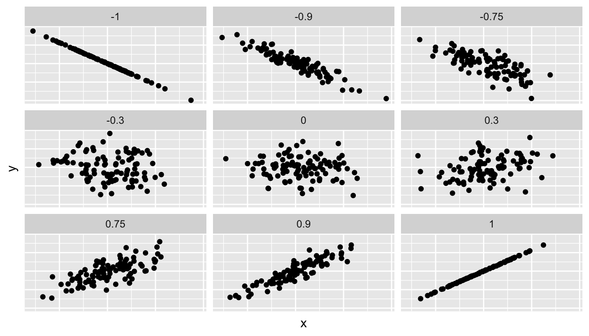
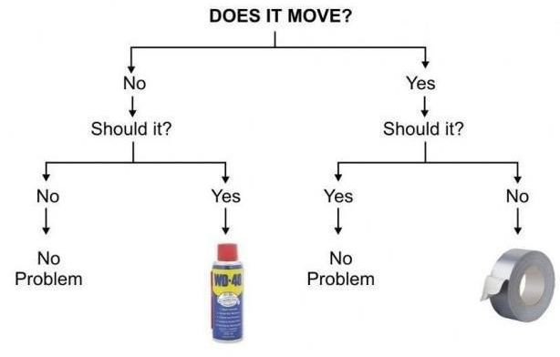
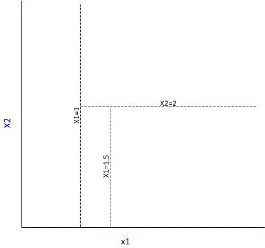
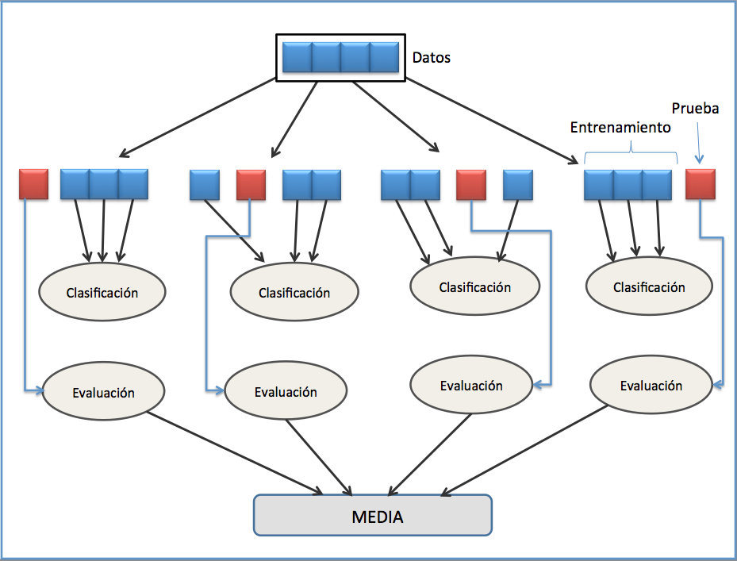

```{r setup, include=FALSE}
knitr::opts_chunk$set(echo = TRUE, message = FALSE)
```

## Modelado Estadístico y Árboles de Decisión

Vamos a ver cómo establecer un modelo para explicar relaciones entre variables. Los modelados de datos se basan en la relación entre:

* Una variable target/dependiente/resultado (variable ```y```).
* Una o varias variables feature/predictoras/explicativas (variable/s ```x```).

El modelado de datos nos puede servir para dos fines:

* Explicar: Explícitamente describir y cuantificar la relación entre ```x``` e ```y``` y posiblemente establecer relaciones causales entre las variables

* Predecir: En base a la información de la/s variable/s ```x```, estimar un resultado probable de ```y```. En este objetivo importa menos como se relacionan las variables, lo que impera es que las predicciones sean certeras.


### Covarianza y Correlación

Antes de pasar a ver modelos de datos específicos, vamos a ver estos dos estadísticos.

La covarianza es la sumatoria del factor entre las diferencias de los valores de x con su media y las diferencias de los valores de y con su media.

* Cuando valores altos de x corresponden a valores altos de y, y valores bajos de x corresponden a valores bajos de y la COVARIANZA es positiva

* Cuando valores altos de x corresponden a valores bajos de y, y valores bajos de x corresponden a valores altos de y la COVARIANZA es negativa

* Cuando no ocurre ninguna de las dos cosas anteriores, la covarianza será muy cercana a cero

La correlación agrega los desvíos a la covarianza, por lo cual puede tomar sólo valores entre -1 y 1 y no es afectada por las unidades de medición. Correlación = 1 significa una relación lineal perfecta positiva, una correlación = 0 indica que no existe una relación lineal entre ```x``` e ```y``` y una correlación = -1 indica una relación lineal perfecta negativa.

La covarianza y la correlación entre 2 variables se pueden calcular con las funciones ```cov()``` y ```cor()```
```{r}
library(tidyverse)
library(GGally)
library(knitr)
library(kableExtra)
#install.packages("printr")
library(printr)
#cars es un set de datos precargado en R (lo van a ver en otros ejemplos de estos temas)
#glimpse() es otra función para ver resumen de los datos (como str(), summary(), y más que hemos visto)
glimpse(cars)
#La covarianza da un valor mayor a 100, que indica covarianza positiva pero no nos da una referencia de cuán alto es el valor
cov(cars$speed, cars$dist)
#Como sabemos que la correlación va entre -1 y 1, vemos que una correlación de 0,8 indicaría que hay una alta correlación entre las variables.
cor(cars$speed, cars$dist)
#Para el dataset cars no nos va a servir mucho porque tiene sólo dos variables, pero la clase pasada vimos una función para graficar de forma múltiple las correlaciones entre los pares de variables de un dataset. 
ggpairs(iris,  mapping = aes(color = Species))
```

La correlación mide el grado de asociación lineal entre dos variables. De ninguna manera implica _causalidad_ (pueden estar presentes ambas, pero correlación no significa presencia de causalidad). La causalidad indica que ```x``` sirve para explicar el comportamiento de ```y```. Puede haber variables con baja correlación pero que exista otro tipo de relación entre ambas (por ejemplo una variable oculta entre ambas), como también variables con alta correlación que no tienen ningún vínculo (correlaciones espurias). Una web que recopila ejemplos de este segundo caso es http://www.tylervigen.com/spurious-correlations

Acá vemos un ejemplo de diferentes valores de correlación



También hay un [juego](http://guessthecorrelation.com/) muy divertido para adivinar las correlaciones de diferentes distribuciones.

### Regresión Lineal Simple

La regresión lineal involucra una variable numérica de output (```y```) y variables explicatorias (```x```) que pueden ser numéricas o categóricas. 

```{r}
library(GGally)
#install.packages("skimr")
library(skimr)
#inspeccionamos el dataset a utilizar
kable(head(mtcars),align = 'c')
#skim es ooootra alternativa para chequear la estructura del dataset.  
glimpse(mtcars)
skim(mtcars)
#Graficamos un scatter plot para ver los pares de distribuciones bivariada del dataset mtcars (es otro de los clásicos precargados en R) 

# Function to return points and geom_smooth
# allow for the method to be changed
my_fn <- function(data, mapping, method="loess", ...){
      p <- ggplot(data = data, mapping = mapping) + 
      geom_point() + 
      geom_smooth(method=method, ...)
      p
    }
# Default loess curve    
ggpairs(mtcars, lower = list(continuous = my_fn))

#Vemos que hay una alta correlación negativa entre wt (peso) y mpg (millas por galón), por lo cual vemos la distribución bivariada en especifico, y también grafico un modelo lineal con geom_smooth()
cor(mtcars$wt, mtcars$mpg)
ggplot(mtcars, aes(x = mtcars$wt, y = mtcars$mpg)) +
  geom_point() +
  labs(x = "Peso", y = "Millas por Galón",
       title = "Relación entre el peso y el consumo de nafta de Mtcars") +  
  geom_smooth(method = "lm", se = FALSE)
```

Aplico el modelo de regresión lineal con la función ```lm()``` (de lineal model). Con el primer parámetro pasamos las variables a incluir en el modelo (separadas por ```~```, el cual separa la primera variable que representa a ```y``` (target) y la segunda variable que representa a ```x``` (feature)). ```lm()``` genera un objeto que es el modelo (formato lista), con diferentes outputs y resultados del modelo (los podemos consultar con ```summary()```)

```{r}
modelolineal <- lm(mpg ~ wt, data=mtcars)
summary(modelolineal)
#Y especificamente los coeficientes
summary(modelolineal)$coef
```

De acá podemos ver que para cada aumento de valor de ```wt``` implica un descenso negativo de millas por galón equivalente a -5.34 puntos. También vemos que ambos coeficientes son estadísticamente significativos, por lo cual podemos concluir que a mayor peso del vehículo, la cantidad de millas por galón es menor (es decir el consumo de nafta es más alto).

También se pueden hacer regresiones si mi variable predictoria es categórica. Vamos a ver con la variable ```am``` que indica si el auto es automático o manual.
```{r}

library(stats)
ggplot(mtcars, aes(y=mpg, x=factor(am, labels = c("automatic", "manual")), fill=factor(am)))+
        geom_violin(colour="black", size=1)+
        xlab("transmission") + ylab("MPG")
```
Si bien las distribuciones se superponen en parte, puede que haya diferencias entre ambos. Hacemos un t-test([prueba t de student](https://es.wikipedia.org/wiki/Prueba_t_de_Student)) para ver si las diferencias de medias de ambos grupos es significativa (con la función ```t.test()```.
```{r}
test <- t.test(mpg ~ am, data= mtcars, var.equal = FALSE, paired=FALSE ,conf.level = .95)
result <- data.frame( "t-statistic"  = test$statistic, 
                       "df" = test$parameter,
                        "p-value"  = test$p.value,
                        "lower CL" = test$conf.int[1],
                        "upper CL" = test$conf.int[2],
                        "automatic mean" = test$estimate[1],
                        "manual mean" = test$estimate[2],
                        row.names = "")
kable(x = round(result,3),align = 'c')
```

La diferencia es significativa entre los dos grupos. Probamos el modelo lineal usando ```am``` como feature.
```{r}
# Creo una variable que haga factor a "am" con los labels de automatico y manual.
mtcars$amfactor <- factor(mtcars$am, labels = c("automatic", "manual")) 
summary(lm(mpg ~ factor(amfactor), data = mtcars))$coef
```

### Regresión Lineal Múltiple

En muchos casos, una sola variable no es suficiente para predecir la variable "target", por lo cual se utiliza una combinación de variables
```{r}
names(mtcars)
summary(lm(mpg ~ cyl+disp+hp+drat+wt+qsec+factor(vs)+factor(am)+gear+carb, data = mtcars))$coef
```

#### Colinealidad

Uno de los mayores problemas de las regresiones multivariadas (como la regresión lineal múltiple) es la colinealidad, es decir que dos o más variables predictoras estén altamente correlacionadas. Esto aumenta nuestro error estándar en el modelo y lo hace muy poco estable. Podemos chequear la multicolinealidad con el Variance Inflation Factor (VIF), para ver qué variables podríamos descartar (no hay que descartar todas las variables correlacionadas, hay que dejar al menos una). 

```{r}
#install.packages("car")
#el paquete car tiene algunas funciones que nos ayudan para trabajar con regresiones
library(car)
fitvif <- lm(mpg ~ cyl+disp+hp+drat+wt+qsec+factor(vs)+factor(am)+gear+carb, data = mtcars)
vif(fitvif)
```
Las variables con valor mayor a 10 de VIF se suelen descartar, mientras de las variables que tienen valores entre 5 y 10 se recomienda dejar una sola.

Hay métodos de selección de variables paso a paso, llamados ````stepwise selection method```.

```{r}
#install.packages("MASS")
#este paquete tiene funciones y datasets incluidos en el libro "Modern Applied Statistics with S"  (S es otro lenguaje de programación)
library(MASS)
fit <- lm(mpg ~ cyl+disp+hp+drat+wt+qsec+factor(vs)+factor(am)+gear+carb, data = mtcars)
#el parámetro both indica que se van a usar la seleccion forward y la eliminación backward. Forward arranca sin variables y va incluyendo las variables más estadísticamente significativas repitiendo el proceso hasta nada mejora el modelo y backward es el método inverso eliminando variables (evaluando si excluyendo variables tengo pérdida de significancia estadística). El parámetro "trace" es para que se imprima el proceso del algoritmo.
step <- stepAIC(fit, direction="both", trace=FALSE)
summary(step)$coeff
```

Podemos observar que aplicando ```stepAIC``` todos los coeficientes son significativos. Vemos que el coeficiente de ```am``` indica que en promedio, los autos con transmisión manual tiene 2.94 MPGs mayor que los autos con transmisión automática. Vemos que este valor es mucho menor que cuando usábamos el modelo usando sólo ```am```.

```{r}
#Aplicamos un modelo con el resultado del step (aunque ya nos había quedado guardado en el objeto "step") y chequeamos que no haya multicolinealidad.
finalfit <- lm(mpg ~ wt+qsec+factor(am), data = mtcars)
vif(finalfit)
#Chequeamos con un qqplot, como se comportan los residuos. Observamos que su comportamiento es el esperado. En el eje x tenemos los cuantiles de una distribución normal y en el eje y los residuos estandarizados. Los residuos no tienen una forma particular, por lo cual mi modelo no presenta alguna anomalía en los residuos.
qqPlot(finalfit, main="Normal Q-Q plot")
#Otras medidas para chequear: distancia cook (influencia de cada observación en el modelo de regresión), residuos vs leverage (distancia de las variables independientes de una observación están respecto a otras observaciones).
```

### Aprendizaje basado en Árboles de Decisión

Vamos a ver una introducción al aprendizaje basado en árboles de decisión. Las primeras versiones de estos modelos fueron implementados por Leo Breiman, que desarrolló algoritmos que implementan aprendizaje basado en árboles de decisión como ID3, C4.5, random forest, entre otros, englobados en la categoría ```Classification and Regression Trees```. En algunos de estos modelos, las elecciones de los atributos se establecen por la entropía, que es una medida que cuantifica la ganancia de información. Lo vamos a ver mejor cuando implementemos un ejemplo de árboles de decisión. El algoritmo que vamos a ver aquí es RPART (Recursive Partitioning And Regression Trees). En minería de datos, los árboles de decisión pueden usarse como clasificación (una clase en la variable target) o como regresión (predecir un valor en número real).

Podemos ver un ejemplo simpácito para pensar la estructura de los árboles de decisión.



Los árboles permiten combinar variables para particionar las clases de nuestros datos de forma lineal pero múltiple (por ejemplo, a diferencia del Análisis Discriminante Lineal), por ejemplo:



Tienen varias ventajas, entre ellas:

* Aceptan datos numéricos y categorizados
* Caja blanca (conjunto de reglas con booleanos), sus resultados son fáciles de entender e interpretar.
* Relativamente robusto.
* Funcionan relativamente bien con grandes conjuntos de datos.
* Combinaciones de los mismos pueden dar resultados muy certeros sin perder explicabilidad, por ejemplo Random Forest.

#### Caret

Para aplicar RPART, vamos a usar el paquete ````caret```, que incluye varios modelos de aprendizaje automático y formas de acondicionar los datos para aplicar dichos modelos. [Aquí](http://topepo.github.io/caret/index.html) hay un muy buen bookdown que repasa muchas de las *funcionalidades* de ```caret```.
```{r}
#install.packages("caret")
#install.packages("rpart.plot")
library(caret)
library(rpart.plot)
#cargamos los datos, de esta manera los descargamos
data_url <- c("https://archive.ics.uci.edu/ml/machine-learning-databases/car/car.data")
download.file(url = data_url, destfile = "car.data")
car_df <- read.csv("car.data", sep = ',', header = FALSE)
#O directamente levantamos el archivo de la web
car_df <- read.csv("https://archive.ics.uci.edu/ml/machine-learning-databases/car/car.data", sep = ',', header = FALSE)

#Chequeamos la estructura del dataset
str(car_df)
kable(head(car_df))
#Trateremos de predecir la clase o variable target llamada "V7"
unique(car_df$V7)
#Estamos trabajando con variables categóricas cuyos niveles están bien especificados, por lo cual no necesitamos normalización.
```

Vamos a preparar los datos para el modelo, primero seteando una semilla para asegurar la replicabilidad de los resultados del modelo. La semilla genera que, aunque la data se divida de manera aleatoria, pero el método de lectura va a tener el mismo método haciendo que los resultados sean los mismos si se corre el mismo modelo. También vamos a separar el dataset de forma aleatoria en un conjunto de entrenamiento y un conjunto de test.

```{r}
set.seed(3033)
#el parámetro p marca la proporción del dataset que va a estar destinada a entrenamiento. también le indicamos la variable target.
intrain <- createDataPartition(y = car_df$V7, p= 0.7, list = FALSE)
training <- car_df[intrain,]
testing <- car_df[-intrain,]
#chequeamos como quedamor training y test
dim(training) 
dim(testing)
#chequeamos si tiene NA
anyNA(car_df)
```

#### Entrenamiento

Caret provee una función para entrenar diferentes modelos. Primero seteamos una función llamada ````trainControl()``` donde definimos el método para controlar el entrenamiento. Con el parámetro de ```method``` indicamos el método de resampleo. En este caso usamos "repeated cross-validation". La validación cruzada permite evaluar los resultados que devuelva el modelo y garantizar la independencia de las particiones que hacemos, con lo cual se evita el sobreajuste. Básicamente, la validación cruzada separa los datos en diferentes particiones y obtiene la media de las diferentes evaluaciones de las distintas particiones. Es una forma de evaluación muy utilizada en aprendizaje automático. Con el parámetro ```number``` seteamos la cantidad de iteraciones de resampleo. El parámetro ```repeats``` marca la cantidad de "folds" para realizar nuestra operación.




Antes de entrenar nuestro árbol de decisión, seteamos la semilla. Al entrenar, paso la variable target ("V7"), el conjunto de datos, el método (es decir el modelo, en este caso "rpart"), los parámetros (que en este caso es una lista que contiene un split por ganancia de información), el método de control (definido como lista anteriormente).

```{r}
trctrl <- trainControl(method = "repeatedcv", number = 10, repeats = 3)
set.seed(1234)
dtree_fit <- train(V7 ~., data = training, method = "rpart",
                   parms = list(split = "information"),
                   trControl=trctrl,
                   tuneLength = 10)
```

Chequeamos el resultado del modelo

```{r}
dtree_fit
```

Podemos visualizar el árbol de decisión que quedó generado, como también varias características del modelo.

```{r}
#metodo usado
dtree_fit$method
#modelo mejor "tuneado". Es el que el parámetro cp (complexity parameter) es menor.
dtree_fit$bestTune
#ploteamos
prp(dtree_fit$finalModel, box.palette = "Reds", tweak = 1.2)
```

#### Predicción

Vamos a ver cómo el modelo entrenado predice los valores de ```test```. Cuidado! Accuracy es una medida que puede omitir sesgos enormes del modelo. Se usa a modo orientativo aquí, se puede combinar con otras medidas como curva ROC.
```{r}
#vamos a predecir la clase del primer registro de test
testing[1,]
#vemos que el modelo predice bien!
predict(dtree_fit, newdata = testing[1,])

#vamos a analizar las predicciones de todo el testing
test_pred <- predict(dtree_fit, newdata = testing)
confusionMatrix(test_pred, testing$V7 )  #Chequeamos "accuracy"
```

Puedo probar entrenar el árbol de decisión con otro criterio de split (índice gini por ejemplo).
```{r}

set.seed(3333)
dtree_fit_gini <- train(V7 ~., data = training, method = "rpart",
                   parms = list(split = "gini"),
                   trControl=trctrl,
                   tuneLength = 10)
dtree_fit_gini

prp(dtree_fit_gini$finalModel, box.palette = "Blues", tweak = 1.2)

# Predicción

test_pred_gini <- predict(dtree_fit_gini, newdata = testing)
confusionMatrix(test_pred_gini, testing$V7 )  #Chequear accuracy
```

Caret tiene muchísimos [modelos disponibles](https://rdrr.io/cran/caret/man/models.html) para utilizar. Lo bueno es que la estructura de preparación de datos es similar, la del paquete. Con lo cual con lo que vimos hoy, lo pueden replicar para el modelo disponible que gusten.
