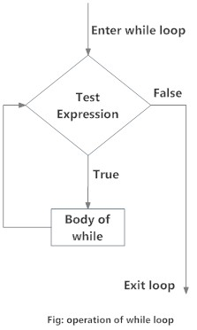

```{r setup, include=FALSE}
knitr::opts_chunk$set(echo = TRUE, message = FALSE)
```

## Preprocesamiento

Si bien a lo largo del curso vimos varias funciones para tratamiento de datos, ahora las vamos a ver algunas herramientas para realizar algunas de las tareas que forman parte del preprocesamiento de los datos, una parte sustancial de la ciencia de datos.

### Valores Faltantes

El tratamiento de valores faltantes es clave. Como hemos visto, muchas funciones tienen un tratamiento específico para los valores faltantes o disclaimers en relación a su tratamiento, de las cuales es importante estar atento. Vamos a ver algunas funciones para detectarlos y tratarlos.

```{r}
head(iris)
#generamos los datos aleatoriamente con un for loop (lo veremos en un rato) y la función sample() que toma una muestra (de 1 en cada vuelta del for loop en este caso). Con i iteramos sobre la columna y con j con la cantidad de veces uqe vamos a imputar NA.
for(i in 1:4) {
  for(j in 1:5) {
    inst.aleat<-sample(1:nrow(iris), 1, replace=F)
    iris[inst.aleat, i]<-NA
  }
}
#filtramos iris por los NA de alguna columna.
library(knitr)
kable(iris[is.na(iris$Sepal.Length),])

#contamos el total de NA para una columna
sum(is.na(iris$Sepal.Length))

#podemos calcular la proporción de NA sobre el total de instancias
round(sum(is.na(iris$Sepal.Length))/nrow(iris)*100,2)

#como ya vimos en la clase 2, puedo hacer un dataframe con el recuento de NA para las columnas

na_count <-sapply(iris, function(y) sum(length(which(is.na(y)))))
na_count <- data.frame(na_count)
na_count

#con la función na.omit() puedo filtrar un dataset por los registros completos (con ningun na en sus columnas)
iris.reg_completos<-na.omit(iris)
nrow(iris.reg_completos)

#recordemos que muchas funciones tienen tratamietno de na, por ejemplo mean()
mean(iris$Petal.Length, na.rm = TRUE)
```

Una vez que detectamos los valores faltantes, podemos ignorarlos, separarlos, trabajar los datos teniendolos en observación o también podemos imputarle un valor con diferentes técnicas. Vamos a ver algunas.

```{r}
#podemos imputar por la media
iris.imp<-iris
iris.imp$media<-iris$Sepal.Length

iris.imp$media[is.na(iris.imp$media)]<-mean(iris.imp$media, na.rm = TRUE)

# Verificamos que no quedan faltantes
sum(is.na(iris.imp$media))

#Podemos imputar con los valores generados de un modelo de regresión
#Armamos el modelo
#iris.imp <- iris
rl_model<-lm(iris.imp$Sepal.Length ~ iris.imp$Sepal.Width+iris.imp$Petal.Length, data = iris.imp)

# Imprimimos los coeficientes del modelo
print(rl_model$coefficients)

# Imputamos en base al modelo
iris.imp$regresion<-iris.imp$Sepal.Length

SW<-iris.imp$Sepal.Width[is.na(iris.imp$Sepal.Length)]
PL<-iris.imp$Petal.Length[is.na(iris.imp$Sepal.Length)]
coef<-rl_model$coefficients

# Hacemos la imputación
iris.imp$regresion[is.na(iris.imp$regresion)]<-coef[1]+SW*coef[2]+PL*coef[3]

iris.imp$regresion[is.na(iris.imp$regresion)]<-coef[1]+iris$Sepal.Width*coef[2]+iris$Petal.Length*coef[3]
# Verificamos que no existen faltantes
sum(is.na(iris.imp$regresion))

#probamos la imputación hot deck, que toma un valor similar random del resto del dataset.
# Cargamos la librería VIM (Visualization and Imputation of Missing Values)
#install.packages("VIM")
library(VIM)

# Definimos un dataframe auxiliar para no perder la variable original
df_aux<-hotdeck(iris, variable="Sepal.Length")
kable(head(df_aux))
iris.imp$hotdeck<-df_aux$Sepal.Length
iris.imp$hotdeckbool<-df_aux$Sepal.Length_imp
# Verificamos que no existen faltantes
sum(is.na(iris.imp$hotdeck))

#imputación MICE (Multiple Imputation by Chained Equations)
# Cargamos la librería
#install.packages("mice")
library(mice)
# Gráfico con el resumen de los missing para el dataset iris
md.pattern(iris)

# Imputamos los datos con pmm (predictive mean matching, para valores numéricos). Lista de todos los métodos de la función: https://www.rdocumentation.org/packages/mice/versions/3.6.0/topics/mice
imputed_Data <- mice(iris, m=5, maxit = 3, method = 'pmm', seed = 500)

#Tomamos los datos completos
completeData <- complete(imputed_Data)

# Los asignamos a una nueva variable
iris.imp$mice <- completeData$Sepal.Length

# Verificamos que no existen faltantes
sum(is.na(iris.imp$mice))

#Podemos analizar gráficamente la imputación
# Quitamos los atributos que no vamos a usar y renombramos Sepal.Length
iris.imp<-iris.imp[,-c(2:5)]
names(iris.imp)[1]<-"original"

# Analisis grafico de los resultados
plot(density(iris.imp$original, na.rm=TRUE), type = "l", col="red", ylab = "Original", ylim=c(0,0.5))
lines(density(iris.imp$media, na.rm=TRUE), type = "l", col="blue")
lines(density(iris.imp$regresion, na.rm=TRUE), type = "l", col="green")
lines(density(iris.imp$hotdeck, na.rm=TRUE), type = "l", col="yellow")
lines(density(iris.imp$mice, na.rm=TRUE), type = "l", col="black")
legend(7, 0.5, legend=c("Original", "Media", 'Regresión', 'Hotdeck', 'MICE'), col=c("red", "blue", 'green','yellow', "black"), lty=1, cex=0.8)
```

### Reducción dimensionalidad

Muchas veces nos interesa poder representar nuestros datos en menos variables de las que contamos, sea para facilitar el análisis o para evitar ciertos problemas que puede conllevar una alta dimensionalidad (por ejemplo la multicolinealidad, que vimos la clase pasada).

```{r}
#Una opción es eliminar las variables con escasa varianza, llamado con low variance factor

# Tomamos los atributos numéricos del dataframe
lvf<-na.omit(iris[,-c(5)])

# Primero normalizamos los datos (Min-Max) a un rango 0-1
for(i in 1:ncol(lvf)) {
  lvf[,i] <- (lvf[,i]-min(lvf[,i]))/(max(lvf[,i])-min(lvf[,i]))
}

# Calculamos la varianza para cada atributo y redondeamos a 4 decimales
varianzas<-round(apply(lvf, 2, var),4)

print(varianzas)
#Y de aquí definimos un "cut-off" para sacar las variables que aporten poca varianza. Es una técnica que debe ser usada luego de analizar el contenido de las variables.

#Como vimos la clase pasada (para evitar la multicolinealidad), podemos eliminar atributos correlacionados. En la clase pasada lo hicimos con VIF (que era específicamente para modelos lineales). Vamos a ver cómo hacerlo "manualmente"

#Hacemos una matriz de atributos correlacionados (de otra manera más!)
#install.packages("gplots")
library(gplots)
library(RColorBrewer)
#esta función cierra un plot específico (en vacío cierra el último plot)
#dev.off()
ds.cor=cor(iris[,-c(5)], use="complete.obs")
heatmap.2(ds.cor,
          cellnote = round(ds.cor,1), 
          main = "Correlación",
          notecol="black",     
          density.info="none", 
          trace="none",        
          margins =c(12,12),    
          col=brewer.pal('RdYlBu', n=5),  
          dendrogram="none",     
          Colv="NA")

#hacemos la matriz de correlación a mano y con caret

#a mano:
data.numeric<-na.omit(iris[,-c(5)])

# Calculo matriz de correlacion
matriz.correlacion<-cor(data.numeric)

# Verifico la Correlación con la matríz
print(matriz.correlacion)

#caret:
library(caret)
# Buscamos atributos con correlaciones superiores a 0.75
highlyCorrelated <- findCorrelation(matriz.correlacion, cutoff=0.75)

# Imprimimos los nombres de los atributos que cumplen con la condición anterior
#highlyCorrelated se guarda con los numeros de columna que superan la correlacion de 0.75
print(names(data.numeric[,highlyCorrelated]))

#Podemos usar modelos como random forest que tienen una opción de devolver la importancia de las variables como predictoras para quedarme sólo con las más importantes
#install.packages("randomForest")
library(randomForest)

model_rf<-randomForest(Species ~ ., data=iris, na.action = na.omit)
#el mean decrease gini se calcula a partir de "Gini Impurity", una métrica que usan los árboles de decisión para splitear. Altos valores de mean decrease gini implican mayor importancia de la variable.
importance(model_rf)
#el paquete permite graficarlo
varImpPlot(model_rf)
```

### Normalización

La normalización de los datos es una parte importante del preprocesamiento de nuestras variables numéricas. Algunos features pueden tener escalas muy divergentes, lo cual puede afectar a la precisión de nuestras predicciones, ya que las variables con largo rango pueden impactar más que las de menor rango. Para esto, tenemos que normalizar o escalar valores para que caigan en un rango común. Vamos a ver diferentes métodos.

```{r}
# Vector edad
edad <- c(25, 35, 50)
# Vector salario
salario <- c(20000, 120000, 200000)
# Data frame 
df <- data.frame( "edad" = edad, "salario" = salario, stringsAsFactors = FALSE)

#Normalización min-max. Es usada tradicionalmente con K-Nearest Neighbors (KNN), un algoritmo de clasificación muy difundido.

#se calcula:
#(X - min(X))/(max(X) - min(X))

#Definimos una función específica que haga la normalización
normalize <- function(x) {
    return ((x - min(x)) / (max(x) - min(x)))
  }

#usamos lapply para aplicar nuestra función de normalización al dataframe.
dfNorm <- as.data.frame(lapply(df, normalize))
dfNorm
kable(head(dfNorm))

#podemos hacerlo sólo sobre el salario
dfNorm <- as.data.frame(lapply(df[2], normalize))
kable(head(dfNorm))

#otra alternativa: dfNorm <- as.data.frame(lapply(df["Salary"], normalize))

#La desventaja de la normalización min-max es que tiende a llevar los datos a la media. Si los outliers tienen que tener peso más que los otros valores, se recomienda usar la estandarización z-score, incluida en la función scale() de R. 
dfNormZ <- as.data.frame( scale(df[1:2] ))
dfNormZ
```

### Consultas SQL

El lenguaje de consultas a base de datos SQL (Structured Query Language) es muy utilizado para ETL relacionada a bases de datos relacionales/tabulares. La estructura básica del lenguaje se realiza con verbos, listados [aquí](https://www.codecademy.com/articles/sql-commands)

Es posible hacer llamados de SQL de varias maneras en R, una es con el paquete ```sqldf``` para aplicarlas sobre dataframes. Simplemente escribimos nuestra consulta SQL

```{r}
dte = seq(as.Date("2011-05-01"), as.Date("2011-05-20"), by=1)
persid = c(1013,1011,1014,1015,1023,1028,1012,1018,1019,1020,1027,
        1016,1022,1017,1021,1024,1030,1025,1026,1029)
v1 = round(rnorm(20), 2)
v2 = round(rnorm(20), 2)
first=c("David","Sara","Jon","Jennifer","Ken","Ralph","Chris","David",
      "David","Joe","Melanie","Debbie","Jessica","Ally","Amy","Ralph",
      "Sara","Jane","John","Lance")
last=c("Smith","Jones","Alberts","Hudson","Jennings","Masterson","Browm",
      "Felt","Spade","Montana","Keith","Hardson","Karson","Roberts","Smith",
      "Jennings","Denver","Hudson","Reynolds","Darder")
stat = c("CA","IA","NC","FL","GA","OH","NY","CA","TX","TX","CA","CA","AZ",
      "CO","OK","MI","WI","SC","VT","IL")

df1 <- data.frame(id=c(seq(1,20)), date=c(dte), var1=c(v1),
            var2=c(v2), personid=c(persid))

df2 <- data.frame(id=c(sort(persid)), firstname=c(first),
            lastname=c(last), state=c(stat))
#install.packages("sqldf")
library(sqldf)

sqldf("SELECT COUNT(*) FROM df2 WHERE state = 'CA'")

sqldf("SELECT df2.firstname, df2.lastname, df1.var1, df2.state FROM df1
INNER JOIN df2 ON df1.personid = df2.id WHERE df2.state = 'TX'")

sqldf("SELECT df2.state, COUNT(df1.var1) FROM df1
INNER JOIN df2 ON df1.personid = df2.id WHERE df1.var1 > 0
GROUP BY df2.state")
```

## Funciones, loops y otras utilidades

### for loops

Este tipo de loop es utilizado para repetear una n cantidad de veces deseada algún bloque de código.

```{r}
# Creamos un vector con valores random dentro de una distribución normal. R tiene varias funciones para generar distribuciones, como rbinom(), rpois() y demás.
u1 <- rnorm(30)
print("Este loop calcula el cuadrado de los primeros 10 elementos del vector u1")

# Inicializamos `usq` (u squared)
usq <- 0

for(i in 1:10) {
  # con el i, que es el elemento a iterar, voy aplicando el loop para cada elemento
  usq[i] <- u1[i]*u1[i]
  print(usq[i])
}

print(i)

sum(iris$Sepal.Length)

for(i in 1:nrow(iris)) {
  iris$Sepal.Length[i] <- iris$Sepal.Length[i]*2.5
}

sum(iris$Sepal.Length)

```

Hay loops con otra condiciones como ```while``` o ```return```.




```{r}
#while loop
while (i < 5){
print(i)
i <- i + 1
}

#repeat loop
x <- 1
repeat {
print(x)
x = x+1
if (x == 6){
break
}
}

```

Hay otras funciones que funcionan como loop (sin necesidad de definir el loop) con cierta estructura, por ejemplo ```ifelse()```

### ifelse()

Esta función nos permite realizar operaciones a partir del resultado de una condición que devuelve un booleano. El primer parámetro es la condición, el segundo parámetro es la operación que se realiza si la condición es ```TRUE``` y el tercer parámetro es la operación que se realiza si la condición es ```FALSE```

```{r}
a = c(5,7,2,9,3)
ifelse(a > 3,"mayor que tres","menor que tres")

#los ifelse() pueden estar anidados, por ejemplo
ifelse(a > 3,"mayor que tres",ifelse(a==3, "tres", "menor que tres"))
```

### purrr (map())

```purrr``` es un paquete de ```tidyverse``` que tiene varias herramientas que constan de reemplazos de diferentes tipos de loops para trabajar con funciones y vectores. Pueden ver su documentación [aquí](https://purrr.tidyverse.org/), que incluye un cheatsheet completo. Este paquete puede reemplazar las funciones de apply que vimos en clases pasadas, muchas de sus funciones se pisan, pero este paquete está bastante organizado para herramientas de programación funcional. Obviamente, stackoverflow nos provee una explicación de por qué usaríamos map(), un de las funciones del paquete que aplica funciones de loopeo en vez de apply [Aquí](https://stackoverflow.com/questions/45101045/why-use-purrrmap-instead-of-lapply). Hay diferentes funciones de map(), dependiendo la estructura de la lista o vector a la que se apliquen.

```{r}

library(tidyverse)

mtcars %>%
  split(.$cyl) %>% # de base R
  map(~ lm(mpg ~ wt, data = .)) %>%
  map(summary) %>%
  map_dbl("r.squared")
```

### paste()

Esta función se usa para concatenar strings y valor que tome como string.


```{r}
#el separador por default es un espacio en blanco
paste("A", "B", "C") 
paste("A", "B", "C", sep="-") 
paste("A", "B", iris$Species[1]) 

#en cambio con paste0(), es vacío el sep por default
paste0("A", "B", "C") 

# Nos podemos poner más complejos:
labels <- paste(c("X","Y"), 1:5, sep="/") 
labels
```

### group_split()

Esta función de ```dplyr``` permite subsetear un dataframe en grupos. Sería como aplicar un ```group_by``` y luego un ```split()```. Con la función ```group_keys``` obtenemos los nombres de las categorías según las cual se spliteó.
```{r}
library(tidyverse)

iris %>%
  group_split(Species)

iris %>%
  group_keys(Species)

```

## Mapas!

Con lo que ya fueron aprendiendo en estas clases, pueden empezar a indagar en el mundo de SIG (Sistemas de Información Geográfica, GIS por sus siglas en inglés), el cual escapaba un poco a los alcances del curso. Muchas librerías en R nos permiten trabajar tanto con datos geográficos como generar mapas con las mismas (leaflet, sf, ggplot2, entre otras). Pueden encontrar una buena introducción en uno de los cursos en los que se basan estas clases, [aquí](https://bitsandbricks.github.io/ciencia_de_datos_gente_sociable/informacion-geografica-y-mapas.html).

## Repositorios

https://paulvanderlaken.com/2017/08/10/r-resources-cheatsheets-tutorials-books/amp/?__twitter_impression=true

https://github.com/data-datum/learning_R

